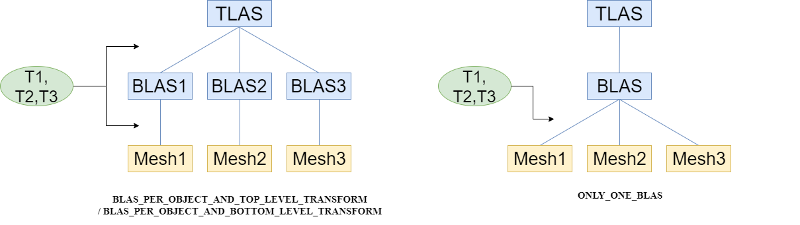
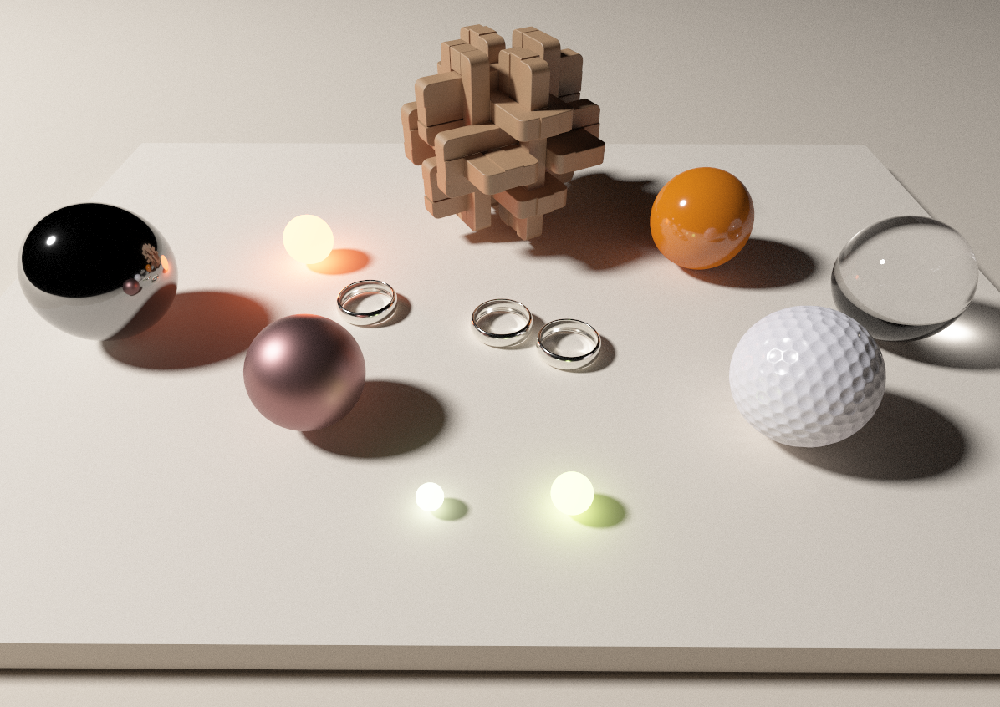
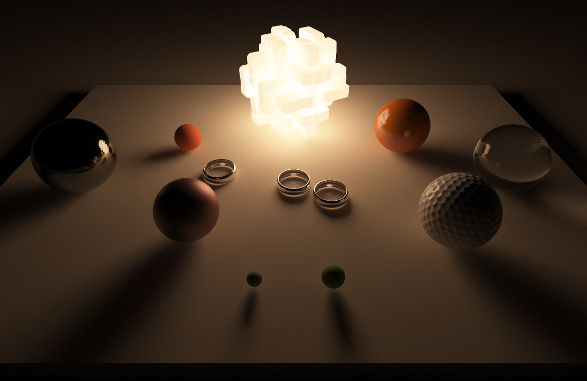
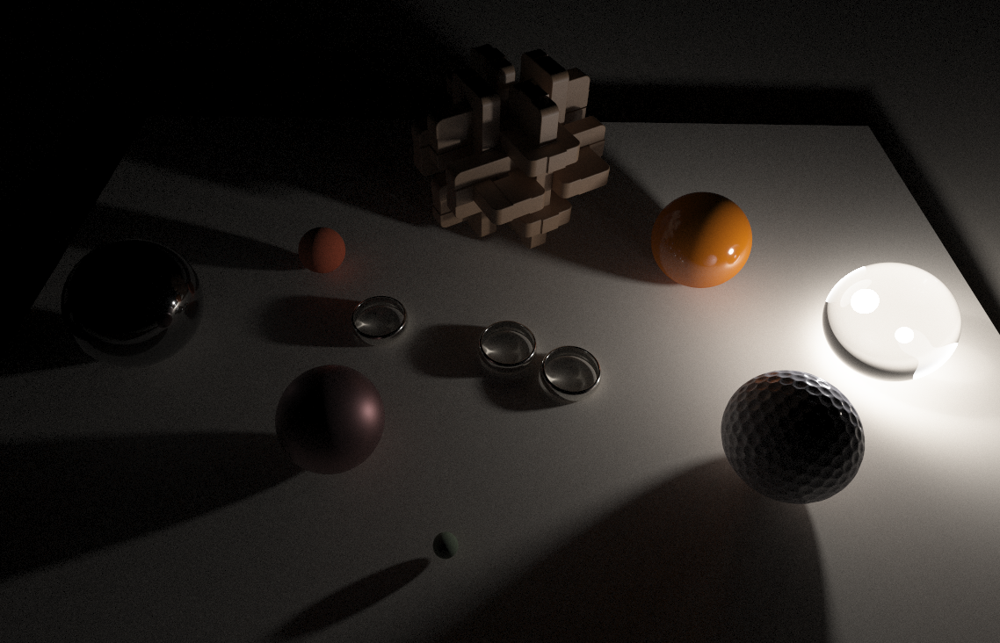

DXR PathTracer
==============
A basic path tracer implementing the forward BRDF sampling using DirectX Ray Tracing (DXR)

Features
--------

- Useful DX12/DXR helpers that reduce your graphic code fairly
- Support various hierarchies for acceleration structure building
- Forward BRDF sampling (GGX/glass) for light tranport
- Every mesh can be a light

DXR Acceleration Structure
--------------------------
 

 
 
An acceleration structure(AS) is a tree-style data structure representing geometry data in a scene of interest for the fast ray-scene intersection test in ray tracing. Especially, DXR's AS consists of two stages. One top-level-acceleration-structure(TLAS) contains a number of bottom-level-acceleration-structures(BLASs). Also, if a geometry has own transformation, it is reflected in the building of TLAS or in the building of BLAS. Thus, when implementing ray tracing scene you have to design how to split your geometries into BLASs and where to place their transformation. Excluding the complex hybrid cases, there are three simple cases as in the above diagram. In this project, you can apply these three types of AS to the same scene by modifying the AS-building flag (ONLY_ONE_BLAS / BLAS_PER_OBJECT_AND_BOTTOM_LEVEL_TRANSFOR / BLAS_PER_OBJECT_AND_TOP_LEVEL_TRANSFORM). In real situations including dynamic objects, however, you would have to construct your own hybrid AS for your goal. 

Images
------

Disney Hyperion's table test scene (https://www.disneyanimation.com/technology/innovations/hyperion)

ToDo List
---------
- Subsurface / Volume scattering
- Denoising
- Support Vulkan raytracing / nVidia OptiX API
